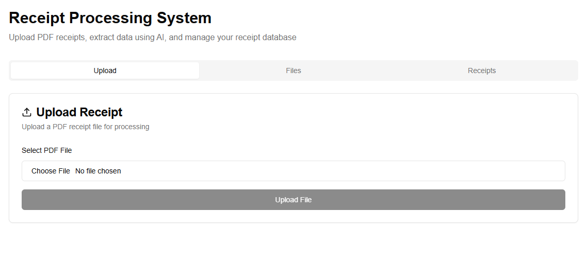
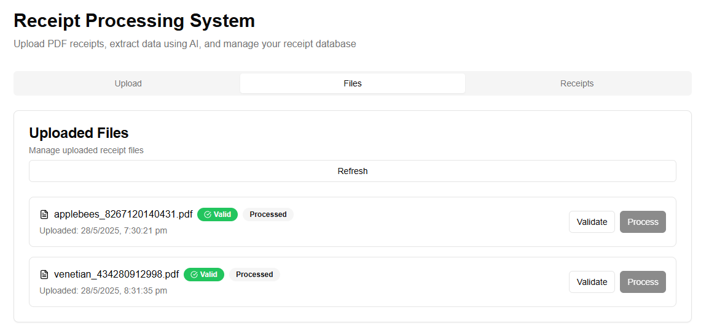
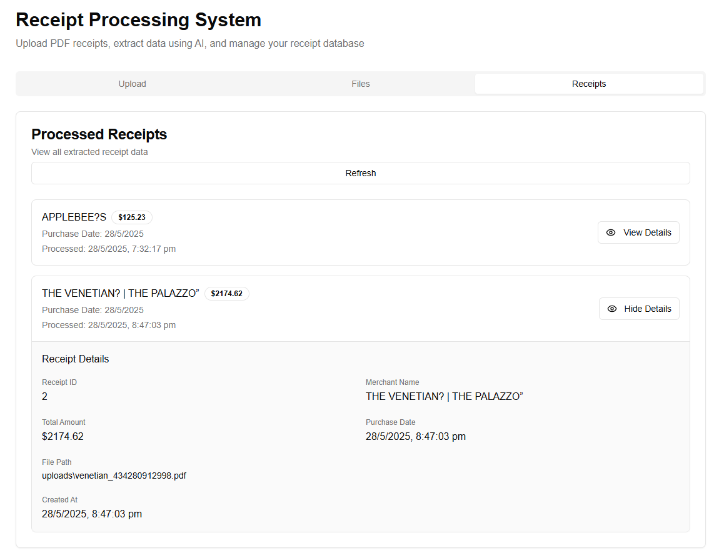

# 🧾 Receipt Processor

This is a full-stack web application for uploading scanned PDF receipts, extracting key details using OCR, and managing them via a FastAPI backend and a modern Next.js frontend.

---

## Usage

### Upload Tab

- Select PDF files using the file input
- View file information before uploading
- Upload files to your backend API

### Files Tab

- View all uploaded files with their status
- Validate PDF files
- Process validated files to extract data
- See processing status and error messages

### Receipts Tab

- Browse all successfully processed receipts
- View merchant names, amounts, and dates
- Click "View" to see detailed information

### Details Tab

- View comprehensive details of selected receipts
- See all extracted information including:
  - Receipt ID
  - Merchant name
  - Total amount
  - Purchase date
  - File path
  - Processing timestamps

## State Management

The application uses React's built-in state management:

- `selectedFile`: Currently selected file for upload
- `uploading`: Upload status
- `processing`: Processing status
- `receipts`: List of processed receipts
- `receiptFiles`: List of uploaded files
- `selectedReceipt`: Currently viewed receipt details

## Error Handling

- **File Validation**: Checks for PDF file type before upload
- **API Errors**: Displays specific error messages from API responses
- **Network Errors**: Handles connection issues gracefully
- **User Feedback**: Toast notifications for all operations

## Styling

The application uses:

- **Tailwind CSS**: Utility-first CSS framework
- **shadcn/ui**: High-quality React components
- **Responsive Design**: Mobile-first approach
- **Dark Mode Ready**: Components support dark mode

---

## 🚀 Tech Stack

- **Frontend:** Next.js (React, Tailwind CSS, Lucide Icons)
- **Backend:** FastAPI (Python)
- **OCR:** Tesseract + PDF2Image
- **Database:** SQLite + SQLAlchemy
- **Storage:** Local file system (PDFs in `uploads/`)

---

## 📁 Project Structure

```
receipt-processor/
├── backend/                 # FastAPI app
│   ├── main.py              # API routes
│   ├── models.py            # SQLAlchemy models
│   ├── database.py          # DB connection
│   ├── ocr.py               # OCR logic
│   ├── utils.py             # Helpers (PDF validation)
│   └── uploads/             # Uploaded PDFs
├── frontend/                # Next.js app
|   |──app/
|   |   ├── page.tsx              # Main application component
|   |   ├── layout.tsx            # Root layout
|   |   └── globals.css           # Global styles
|    components/ui/            # shadcn/ui components
|   ├── button.tsx
|   ├── card.tsx
|   ├── input.tsx
|   ├── label.tsx
|   ├── tabs.tsx
|   ├── badge.tsx
|   └── ...
|   hooks/
|   ├── use-toast.ts          # Toast notification hook
|   └── use-mobile.tsx        # Mobile detection hook
```

## ⚙️ Setup Instructions

### 🐍 Backend (FastAPI)

1.  Navigate to the backend directory:

    ```bash
    cd backend
    ```

2.  Create a virtual environment:

    ```bash
    python -m venv venv
    source venv/bin/activate    # On Windows: venv\Scripts\activate
    ```

3.  Install dependencies:

    ```bash
    pip install -r requirements.txt
    ```

4.  Start the FastAPI server:

    ```bash
    uvicorn main:app --reload --host 0.0.0.0 --port 8000
    ```

5.  Test it:

    - API docs: http://localhost:8000/docs

> 📌 **Note**: Make sure you have [Poppler](https://github.com/oschwartz10612/poppler-windows/releases) and [Tesseract OCR](https://github.com/tesseract-ocr/tesseract) installed and added to your PATH.

#### Installing Poppler and Tesseract OCR (Windows/Bash)

**For Windows:**

1.  **Install Poppler:**

    - Go to the Poppler for Windows releases page: [https://github.com/oschwartz10612/poppler-windows/releases](https://github.com/oschwartz10612/poppler-windows/releases)
    - Download the latest release (e.g., `poppler-*-win64.zip`).
    - Extract the contents of the zip file to a directory of your choice (e.g., `C:\Poppler`).
    - Add the `bin` subdirectory of the extracted Poppler folder to your system's PATH environment variable. For example, if you extracted to `C:\Poppler`, add `C:\Poppler\bin` to your PATH.

2.  **Install Tesseract OCR:**

    - Go to the Tesseract OCR GitHub page: [https://github.com/tesseract-ocr/tesseract](https://github.com/tesseract-ocr/tesseract)
    - Look for a link to the installer for Windows (often found in the "Downloads" or "Installing Tesseract" section, or search for "Tesseract-OCR-\*-Setup.exe").
    - Download and run the installer. Follow the on-screen instructions.
    - During installation, ensure that the option to add Tesseract to your system PATH is selected, or manually add the installation directory (e.g., `C:\Program Files\Tesseract-OCR`) to your system's PATH environment variable.

**For Linux (Bash):**

1.  **Install Poppler (command-line utilities):**

    - On Debian/Ubuntu:
      ```bash
      sudo apt-get update
      sudo apt-get install poppler-utils
      ```
    - On Fedora:
      ```bash
      sudo dnf install poppler-utils
      ```
    - On Arch Linux:
      ```bash
      sudo pacman -S poppler
      ```

2.  **Install Tesseract OCR:**

    - On Debian/Ubuntu:
      ```bash
      sudo apt-get update
      sudo apt-get install tesseract-ocr
      ```
    - On Fedora:
      ```bash
      sudo dnf install tesseract
      ```
    - On Arch Linux:
      ```bash
      sudo pacman -S tesseract
      ```

After installing both, you can verify their installation by opening a new terminal and typing `pdftoppm -v` and `tesseract -v`.

---

### 💻 Frontend (Next.js)

1.  Navigate to the frontend directory:

    ```bash
    cd frontend
    ```

2.  Install dependencies:

    ```bash
    npm install
    ```

3.  Run the development server:

    ```bash
    npm run dev
    ```

4.  Open in browser:

    - Frontend: http://localhost:3000

---

## ✅ API Endpoints (FastAPI)

| Method | Endpoint          | Description                            |
| ------ | ----------------- | -------------------------------------- |
| POST   | `/upload`         | Upload a PDF file                      |
| GET    | `/validate?id=ID` | Validate the PDF                       |
| POST   | `/process?id=ID`  | Extract data via OCR                   |
| GET    | `/receipts`       | List all extracted receipts            |
| GET    | `/receipts/{id}`  | Get one receipt by ID                  |
| GET    | `/receipt-files`  | List uploaded files + validation state |

---

## 🧠 Features

- Upload PDF receipts
- Validate and parse them with OCR (Tesseract)
- Extract `merchant name`, `purchase date`, and `total amount`
- Store in SQLite
- Manage and view in a modern tabbed interface

---

## 📦 Dependencies

### Backend

```
fastapi
uvicorn
sqlalchemy
pydantic
pytesseract
pdf2image
pillow
PyMuPDF
python-multipart
```

### Frontend

```
next
react
tailwindcss
axios
lucide-react
```

---

## 🖼 Screenshots

### 🔼 Upload a Receipt

Upload a scanned PDF receipt and submit it for processing.

## 

### 📁 View Uploaded Files

Validate and process uploaded PDFs from the file management tab.



---

### 📋 View Extracted Receipts

See all extracted receipts and view detailed data per receipt.

## 

---

## 📹 Demo Video

🎥 [Click to watch the demo](./assets/demo.mp4)

## 🛠 Troubleshooting

- ❌ `FileNotFoundError` in PDF2Image: Install Poppler and add it to PATH
- ❌ Tesseract not found: Install Tesseract OCR and add to PATH

---

## 📃 License

MIT

---

## ✨ Credits

Built by Aleazer Viannie Sunn for Automate Accounts Developer Assessment.
